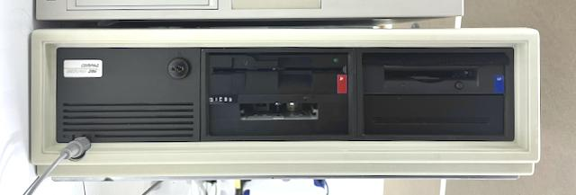

# Compaq DeskPro 286

Well-known and documented, beautifully built AT-compatible computer.

Bought in April 2023 for 80 GBP. Owner claims it was working in 1987. Item has been listed month before, when "cap near power supply just blew".

## Initial repair

Inside there was lots of dust and a few traces of rust, so the board and PSU was dusted off, and the case was fully disassembled, washed, and treated with de-rusting agents.

Upon visual inspection, burned tantalum capacitor C2 was found on -12V power rail. Removing this capacitor resolved the short on this rail. 

During first power-up another tantalum C12 has burned on main 12V rail. Power supply produced only ~3.8V on 5V rail; therefore, lab power supply has been used for powering up the 5V rail only. Further search and inspection confirmed dead C28.

Board came up while consuming around 2.2A (so the PSU is probably bad), indicating a beep code.

## Restoration

1. New PSU
2. Original style drives
3. Age appropriate cards: video, ide, peripheals
4. Retrobright
5. Sound

TBD: PS/2 to InPort BUS mouse, PS/2 adapter on the back of the case

## Software

[Nina] has good series of toots on it.

## Resources:

* [COMPAQ DeskPro to EIA-741 SFF](../assets/c286rail.zip) (STEP, 52K)
* Manuals
* BIOS firmware
* Original software

[reddit-psu]: https://www.reddit.com/r/vintagecomputing/comments/io9wgn/anyone_with_a_compaq_deskpro_286386_power_supply/
