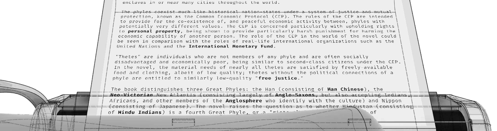
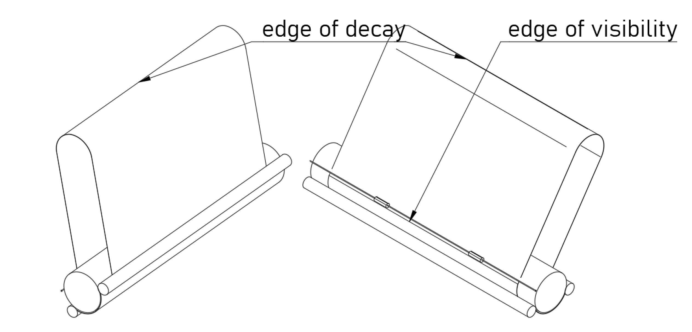

# Infinite Paper Machine

Computer interface for a typewriter. Inspired by 
* TTY interfaces for their line-by-line UX;
* OberonOS, C64 BASIC for type anywhere command interfaces; and
* [The Diamond Age] for pen and paper messaging interface.

Imagine a TTY interface that allows you to scroll the paper output both forwards and backwards with a line feed knob or lever. Opening an email, or manpage, or an article won't create massive scroll action, and text could be read in a comfortable pace.

Spending paper on the interface is cruel, and despite the existance of flexible e-paper, it would still suffer from the refresh speed. To address this, the sheet is looped, and only the invisible part is scrubbed, leaving the empty space for the new text.

Current output creates context, which could be used for subsequent actions. Forwarding an article, or trying out a command in repl terminal. Those actions might start right in the middle of the current output, at the caret position, and without modifying the exisiting content. Occasionally, paper margins could be used to enrich the output.

TBD
