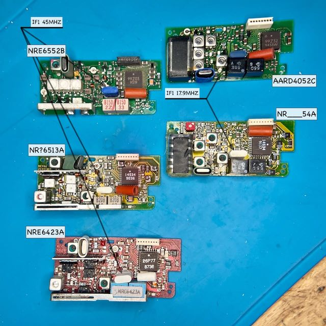

# Motorola POCSAG Pager

## RF boards

Here is the compiled list of known part numbers. Some of it can be decoded using [aaannnn](https://www.repeater-builder.com/motorola/aaannnn-numbering-scheme.html) and [suffix](https://www.repeater-builder.com/motorola/moto-suffixes.html) tables:

1. AA or N means country of origin, could be "Made in the USA" and "Portable product (i.e. Florida manufacturing plants)"
2. R "Receivers and receiver related"
3. D/E/F stands for 144-174 MHz or 406-470 MHz or 900MHz band

<pre>
Model	        Band		X	2nd osc		1st (Xtal)
AARD4050        138-143 A	x2
 NRD7211A,B     same
AARD4051        143-148.6 B	x2 
AARD4051A       143-148.9 B	x2	17.445          62.55-65.35     KXN6300AA
 NRD7212A,B     same
AARD4052        148.6-152 C	x3
 NRD7213A,B     same
 NRD7717A       LS750 RCVR VHF POCSAG SP-C
AARD4053        152-159	D	x3 G: ALT BRAVO II REC NAFTA
 NRD7214A,B     same
AARD4054        159-164 E
 NRD7215A,B     same
AARD4055        164-169	F	
 NRD7216A,B     same
AARD4056B-D     169-172
AARD4056A       169-174 G
 NRD7217A,B     same
 NRD7727A0      153-164 LS750 VHF POC RCVR
 NRE6421A,B     406-420
 NRE6550B       406-423		x8
 NRE6512        KEYNOTE UHF RECVR B SPLIT
 NRE6551B       435-450		x8      44.545		48.75-50.625    
 NRE6513        KEYNOTE UHF RECVR C SPLIT
 NRE6552B       450-465 UHF BRAVO II
 NRE6423A,B     same
AARE4001A-0,1   same
 NRE6553B       465-480
 NRE6424A,B     same
AARE4002A-0,1   same
 NRE6555B       495-512
 NRE6426A,B     same
 NRF4071E       928-932		x12     44.545	        73.67-73.92	NXN3000A (Y551)
 NRE6602A1      450-457 UHF SERVICE RCVR
 NRE6602A3      464-471
 NRE6611A3      448-469 LS750 UHF POC RCVR
</pre>

For re-crystalling, VHF manual calls for a KXN6300AA (167651, 167652), and UHF manual calls for a KXN6301AA
Ther also KXN6236AA (167647, 167648) in [ICM catalogue](https://www.repeater-builder.com/motorola/icm-ce-mot.html).
It's AT cut, third overtone, are used in a series resonant circuit, have about 5 picofarads (pf) of capacitance, and have about 25 ohms of resistance. Case: UM-1/4/5.

## DAPNet

VHF: TBC, as not available in the UK

UHF: 49.3734375MHz, calculated as `(439.9875 - 45)/8`, within `455kHz/2` PN KXN6236AA (167648).

## Sources:

* Hi-res [front](../assets/motorola-rf-boards-front.jpg) and [back](../assets/motorola-rf-boards-back.jpg) pictures.
* [Folkscanomy Electronics Articles: Pager Handbook for the Radio Amateur](https://archive.org/details/fea_Pager_Handbook_for_the_Radio_Amateur)
* [AARD4050B\D through AARD4056B\D schematics](../assets/AARD4050-6BD.zip)
* [Repeater Builder / Motorola](https://www.repeater-builder.com/rbtip/mojoindex.html)
* [Servicing pagers by David Ludvigson](http://datashed.science/misc/MRT-Pagers-Series-Complete-Pt1-Pt19.pdf)
* [Boards shots](../assets/nr.zip) from "Servicing pagers by David Ludvigson"
