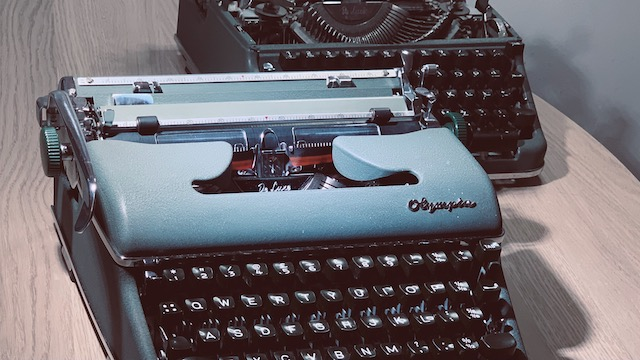

# Olympia SM4

In search for the ultimate, [lasting] writing tool.

## Prologue

[Nina] writes scenarios and outlines for her art project, and she has been in constant search for distraction free writing tool. She's been using Cold Turkey Writer, Windows 3.1 with Word, going outside with offline iPad, etc. She even been looking for old computers, tho they was generally poor quality, like Psion 5 has terrible LCD. 

New Psions, and other devices, including e-ink ones in this segment are positioned as typewriters. They are usually cost as actual used, classic, mechanical, and high-performance typewriters. She managed to find one way cheaper, and both she and I eventually purchased two of them for about 50 GBP each.

## Repair

First one was in a vary good mechanical condition, seemed to be used a lot and serviced. Hovewer, all the shiny chromium parts were in a bad shape. And it has two major issues: escapement wheel has been damaged, and the rubber platen dried and hardened.

We was very lucky that there was to get two of them same model. Second machine was hardly used, but also never maintained, and stored badly. So it has a nice soft resin on it's platen, and the mechanism was intact, despite not being oiled for ages. 

It took a few evenings to remove and disassemble the carriage for parts, to figure out the way to remove the escapement mechanism, and to replace parts back. Service manual wasn't much of a help because of *missed context*: all the parts has proper names that I didn't know.

[Mechanisms and Mechanical Devices Sourcebook](../assets/Mechanisms_and_Mechanical_Devices_Source.ris) would be a lot of help there.

## Writing

1. There are almost no distractions from the flow, and even more, it gives nice tactile feedback that we ADHD generation so in love with; and
2. Typewriters are write-only, so it is hard to be stuck on rephrasing a paragraph for long.

To increase OCR quality, ensure that the platen is soft, and the type is clean.

## Critique

Big downside of typewriters is that they are seriously complicated. 

> Pencils are the pretty much as distraction free as you can get, the cost is readability, but it's resilient and they're not too difficult to make.

See also [Infinite Paper Machine][infinite-paper-machine].
