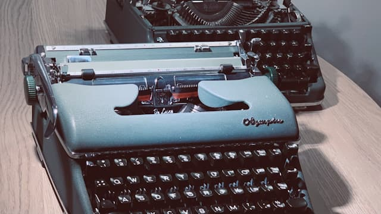

# Olympia SM4

In search for the ultimate, [lasting] writing tool.

## Prologue

[Nina] writes scenarios and outlines for her art project, and she has been in constant search of a distraction-free writing tool. She's been using Cold Turkey Writer, Windows 3.1 with Word, going outside with an offline iPad, etc. She has even been looking for old computers, tho they were generally poor quality like Psion 5 has terrible LCD.

New Psions and other devices, including e-ink ones, are positioned as typewriters in this segment. They are usually cost as used, classic, mechanical, and high-performance typewriters. Nina managed to find one way cheaper, and both she and I eventually purchased two of them for about 50 GBP each.

## Repair

The first one was in a very good mechanical condition, seemed to be used a lot and serviced. However, all the shiny chromium parts were in bad shape. And it has two major issues: the escapement wheel has been damaged, and the rubber platen dried and hardened.

We were very lucky that there was to get two of the same model. The second machine was hardly used but also never maintained and poorly stored. So it has an excellent soft resin on its platen, and the mechanism was intact, despite not being oiled for ages.

It took a few evenings to remove and disassemble the carriage for parts, to figure out the way to remove the escapement mechanism, and to replace parts back. The service manual wasn't much of a help because of *missed context*: all the details have proper names that I didn't know.

[Mechanisms and Mechanical Devices Sourcebook](../assets/Mechanisms_and_Mechanical_Devices_Source.ris) would be a lot of help there.

## Writing

1. There are almost no distractions from the flow, and even more, it gives nice tactile feedback that we ADHD generation so in love with; and
2. Typewriters are write-only, so it is hard to be stuck on rephrasing a paragraph for long.

To increase OCR quality, ensure that the platen is soft and the type is clean.

## Critique

The big downside of typewriters is that they are seriously complicated.

> Pencils are the pretty much as distraction-free as you can get, the cost is readability, but it's resilient, and they're not too difficult to make.

See also [Infinite Paper Machine][infinite-paper-machine].
