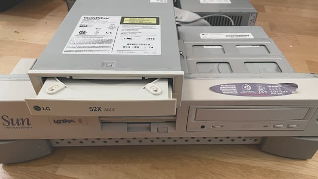
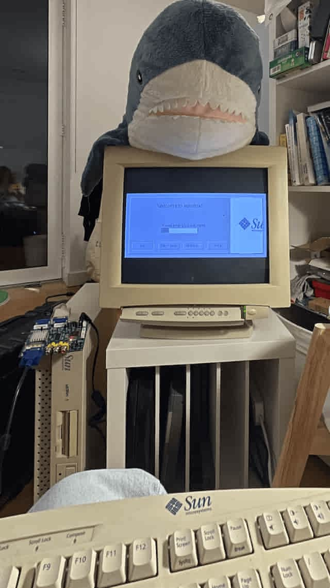

# Sun ULTRA 5

It was used by [Andy Colebourne] to work on AC3D.

## The internals

It's a quite neat "pizza-box" computer with spacious layout inside. PCI riser dominating the system part, and a PSU/CD-ROM/FDD filling up the rest. Infamous RTC/CMOS chip is modified by previous owner and features coin battery holder.

## The boot-up

Pulled a hard drive and inspected the linux installation, reset the root password, and assembled it back.

Connected a keyboard/mouse and a VGA monitor, powered on, got some LED blinks, some HDD seek noises. Didn't get anything on the screen tho. Knowing that it might be already in linux, tried poking it blindly with SysRq and succeeded in rebooting.

Internet mentions that VGA might not work out-of-the-box: integrated ATI RAGE has [sync-on-green] output and it's not working on mine and many others displays.

 so pulling the hard drive again and setting up serial consoles (urgh, Ubuntu 7.something is using event.d). The workstation has two serials, DB25 with sockets on port A and DB9 wirt pins on port B; gonna <s>have fun</s> struggle with the wide one, so all the hopes on latter&nbsp;&mdash; there is very specific null-modem-usb-serial exacttly for this.

Assembled it back, powered it up, waited for a minute and ...we're IN. Tried to make the kernel to print out the boot log, but tough luck.

Back to internets, it tells that there is a system console when the keyboard is not plugged. A-a-and with the transgender adapter it shows the OpenBoot.

## The repair

Quick diagnostics shows second issue: the CD-ROM times out while reading files. It started working (kind of) after some nice cleaning; turns out it was all covered with the UK finest black dust. I replaced original LG CRD-8240B with the similar model, CRD-8521B from 2001, which differs in details like the board size, mechanics, and the drive speed, but has exactly the same front face, making the face swap possible. This will preserve original look!

## SunOS 5.6

I installed full Solaris 2.6 (SunOS 5.6), so I can run some programs. Finally, I can configure framebuffer to 640x480 and get the singal to the [sync converter], and then CRT.

It has no usable shell which makes the exploration *very* annoying. However, there at least some line editing with `telnet`/`openwin`/X forwarding. 

## ToDo

* `dtpower(1M)`

[sync-on-green]: http://web.archive.org/web/20221219134745/http://ps-2.kev009.com/sog/
